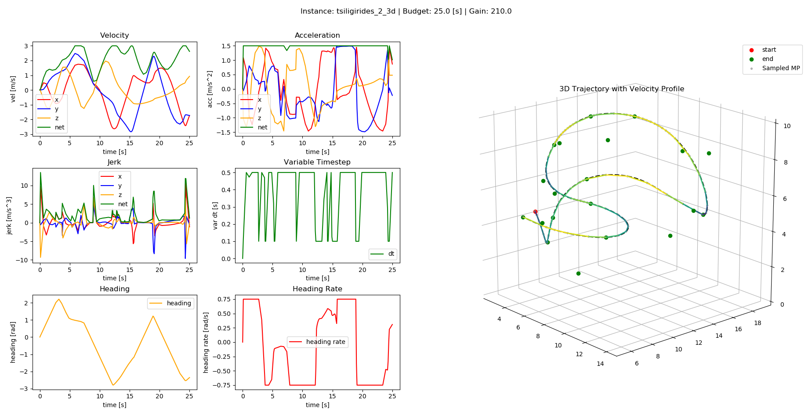

# VT-MPC: Variable Time-step MPC for Agile Multi-rotor UAV Interception of Dynamic Targets

This repository contains the code accompanying the submission of the manuscript titled "Variable Time-step MPC for Agile Multi-rotor UAV Interception of Dynamic Targets" to IEEE RA-L

The repository is organized as below:

- [scripts/vt_mpc_kop_planner.py](scripts/vt_mpc_kop_planner.py): Planner module to run the VT-MPC planner for KOP in 3D. **Navigate to the scripts folder and run `python3 vt_mpc_kop_planner.py`**
- run parameters are defined in the [params file](./config/run_params.yaml). These include dynamic constraints and planner parameters.
- dataset files can be found [here](./dataset/)[every line contains {x} {y} {z} {reward} for a target point]

The planner module combined with a ROS interface with the [MRS UAV System](https://github.com/ctu-mrs/mrs_uav_system) is used for real time planning and experiments.
___

### Sample output

# Dependencies

- [HSL packages for IPOPT](https://licences.stfc.ac.uk/product/coin-hsl)
- [do_mpc](https://www.do-mpc.com/en/latest/) Python Package

The script has been tested with Python 3.8.10 on Ubuntu 20.04 